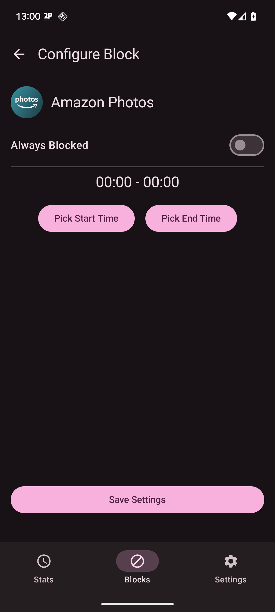

# Zen helps you block distracting apps all the time and on a schedule.

## Stats screen:

This screen shows you your total app usage for the day (from local midnight) and the usage of each app, along with a percentage of total usage.

## Blocks screen:

This is where most of the actions are, in this screen you can view your current app blocks, delete you app blocks, and make new ones.

### New block:

On this sub menu, you can pick or search for an app in the list. After you pick an app to block you will get sent to the next sub menu.

### New block settings:

On this sub menu you have the option to set the app as always blocked, or only blocked during a schedule.

### App blocked screen:

This is the page that shows when you open a blocked app, it tells you how much time you have spent on it and asks if you want to use it for 5 minutes or do something else.

## Settings:

Right now there aren't any settings.